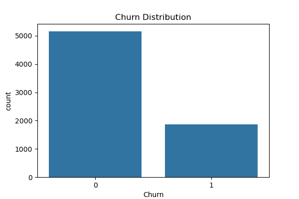
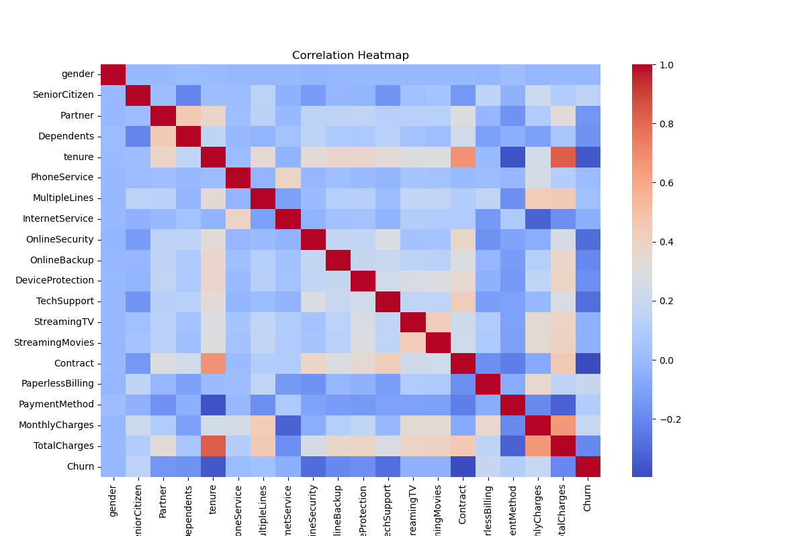
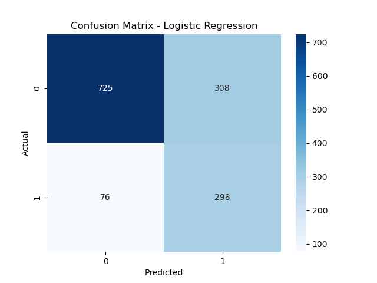
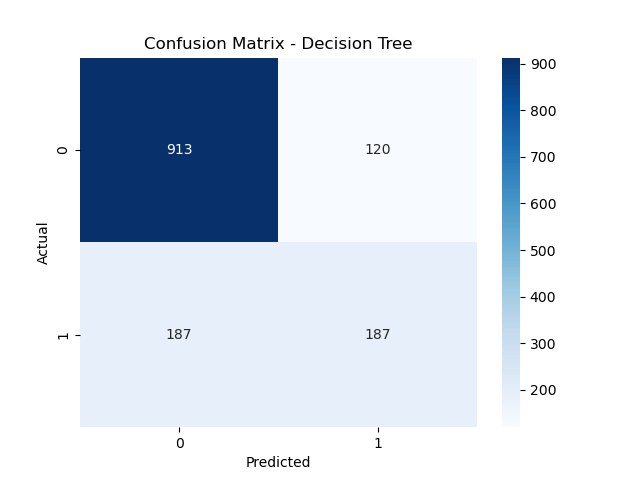
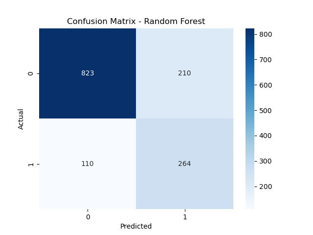

# Customer Churn Prediction

## Description
This project aims to predict which customers are likely to churn from a telecommunications company. Multiple classification models are used: **Logistic Regression**, **Decision Tree**, and **Random Forest**.

Dataset used: [Telco Customer Churn Dataset](https://www.kaggle.com/datasets/blastchar/telco-customer-churn)

---

## 1. Library Imports
Standard libraries are used for:
- Data manipulation: `pandas`, `numpy`
- Visualization: `matplotlib`, `seaborn`
- Machine Learning: `sklearn` (models, scaling, metrics)

---

## 2. Loading the Dataset
```python
df = pd.read_csv("Telco-Customer-Churn.csv")
print("Dataset shape:", df.shape)
df.head()
```
- The dataset contains numeric and categorical columns.
- The `TotalCharges` column had empty or space values, so it was cleaned and converted to numeric.

---

## 3. Data Cleaning
- Drop the `customerID` column
- Convert `TotalCharges` to numeric and drop rows with missing values
- Encode categorical variables using `LabelEncoder`

---

## 4. Exploratory Data Analysis (EDA)
- **Churn Distribution**
```python
sns.countplot(x="Churn", data=df)
plt.show()
```
- **Correlation Heatmap**
```python
sns.heatmap(df.corr(), cmap="coolwarm")
plt.show()
```

---

## 5. Data Preparation
- Separate features (`X`) and target (`y`)
- Split into training and test sets (80%-20%)
- Standardize features using `StandardScaler`

---

## 6. Model Training

### Logistic Regression
```python
log_reg = LogisticRegression(
    C=2.0,
    penalty='l2',
    max_iter=2000,
    class_weight='balanced',
    solver='lbfgs'
)
log_reg.fit(X_train, y_train)
y_pred_lr = log_reg.predict(X_test)
```

### Decision Tree
```python
dt = DecisionTreeClassifier(max_depth=5, random_state=42)
dt.fit(X_train, y_train)
y_pred_dt = dt.predict(X_test)
```

### Random Forest
```python
rf = RandomForestClassifier(
    n_estimators=200,
    max_depth=10,
    class_weight='balanced',
    n_jobs=-1,
    random_state=42
)
rf.fit(X_train, y_train)
y_pred_rf = rf.predict(X_test)
```

---

## 7. Model Evaluation
- Confusion Matrix and Classification Report for each model
- ROC-AUC Scores
```python
print("ROC-AUC Scores:")
print("Logistic Regression:", roc_auc_score(y_test, log_reg.predict_proba(X_test)[:,1]))
print("Decision Tree:", roc_auc_score(y_test, dt.predict_proba(X_test)[:,1]))
print("Random Forest:", roc_auc_score(y_test, rf.predict_proba(X_test)[:,1]))
```

---

## 8. Observations
- Models train quickly on this dataset.
- Increasing Random Forest parameters increases True Positives but decreases True Negatives.
- Optimized Logistic Regression provides the best balance between True Positives and True Negatives.
- Overall accuracy is ~0.73, but the minority class (churn) should be evaluated using recall and F1-score.

---

## 9. Recommendations and Next Steps
- Experiment with prediction threshold in Logistic Regression to optimize precision and recall
- Additional feature engineering
- Additional visualizations to analyze relationships between features and churn

---

## 10. Visualizations
- Distribution plots, boxplots, and scatterplots for EDA analysis




- logistic regression  

  

- decision tree  

  

- random forest  




